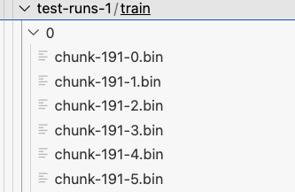
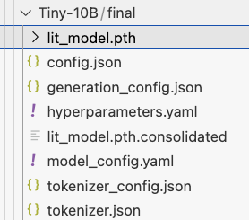

# Steps to Pretrain

Run the following commands in the virtual environment. You can activate the virtual environment by running

```
poetry shell
```

or prefix the commands with `poetry run` to run them in virtual env.

## Step 0: Download the Fine-Web dataset from Hugging Face for model training. 

For the model training experiments, we used a sample dataset with 10Billion tokens from HF Fineweb https://huggingface.co/datasets/HuggingFaceFW/fineweb/tree/main/sample/10BT

## Step 1: Preparing data for model training

Assuming the data is available as parquet file, the first step is to convert the parquet files into [streaming datasets](https://github.com/Lightning-AI/litdata) that can be used for efficient model training. This step also tokenizes the data and stores it efficiently for distributed model training.

To convert the parquet files stored at `/home/ray/efs/team/datasets/fineweb/sample_fine_web_10BT` run the following command:

```
python optimize_dataset.py --input_dir="/home/ray/efs/team/datasets/fineweb/sample_fine_web_10BT" --tokenizer_dir="/home/ray/efs/cluster/checkpoints/meta-llama/Meta-Llama-3-8B" --output_dir="/home/ray/efs/cluster/optimized-dataset"
```

This command distributes the processing of parquet files among all the nodes in the cluster equally. Each optimize worker uses a single CPU and processes a parquet file at a time. Number of parallel processes is limited by the total number of CPUs available on the cluster.

The output would be as follows: .

There are a set of bin files (Streaming dataset) produced against each parquet file. The subfolder (`0`, `1` etc) represents the cluster node which processed the parquet file.

## Step 2: Merging the files from the previous step into a single directory. 

Next, we merge the bin files (Streaming dataset) produced in the previous step into a single directory and update the file metadata present in index.json.

```
python merge_files.py --source_dir="/home/ray/efs/cluster/optimized-dataset/train" --target_dir="/home/ray/efs/cluster/data/optimized-fine-web-sample10BT/train"
```
This will produce a single directory containing all the bin files with updated file metadata. 

Similarly run the same command for moving validation dataset into a single directory

```
python merge_files.py --source_dir="/home/ray/efs/cluster/optimized-dataset/val" --target_dir="/home/ray/efs/cluster/data/optimized-fine-web-sample10BT/val"
```

## Step 3: Start Pre-training

Now, you are ready to pre-train. 

Set the key for the weight and biases to log your training run.

```
export WANDB_API_KEY='<YOUR_KEY_HERE>'
```

Next, start the pretraining run: 

```
python distributed_pretrain.py --config config_hub/llama3-8b.yaml
```

or

```
python distributed_pretrain.py --model_name Meta-Llama-3-8B  --dataset_path=/home/ray/efs/cluster/data/optimized-fine-web-sample10BT --num_nodes=4 --out_dir=/home/ray/efs/cluster/pretrained-checkpoints/H100/sample-10B

```

You can either create a config file under `config_hub` and pass it to distributed_pretrain.py or pass the arguments via the command line.

The final model checkpoints will be stored at `/home/ray/efs/cluster/pretrained-checkpoints/H100/sample-10B` or the path you have specificed in the config file.



Note that the distributed checkpoints are stored in the directory `lit_model.pth`. There is one checkpoint from each GPU/worker.

## Step 4: Consolidated sharded checkpoints to a Single File

Next, lets convert the distributed checkpoint to a regular, single-file checkpoint. You will need to do this for example if you want to load the checkpoint into a script that doesn’t use FSDP, or need to export the checkpoint to a different format for deployment, evaluation, etc.

```
python -m lightning.pytorch.utilities.consolidate_checkpoint /home/ray/efs/cluster/pretrained-checkpoints/H100/sample-10B/final/lit_model.pth/
```
This will generate a file called `lit_model.pth.consolidated` which is a consolidated checkpoint. litgpt utilities like chat look for a single file named lit_model.pth. So lets rename `lit_model.pth.consolidated` to `lit_model.pth`. There is also a directory with the name `lit_model.pth` which contains distributed checkpoint, so lets first rename that directory. 

```
mv lit_model.pth distributed_checkpoint

mv lit_model.pth.consolidated lit_model.pth
```

## Step 5: Export checkpoint

After training is completed, you can convert the checkpoint to a format that can be loaded for evaluation, inference, finetuning etc. The pretrained checkpoint contains optimizer states and several other metadata that are not needed after training is finished. This script will export the state-dict of the model and place it in the chosen output folder, which then can be loaded by other scripts for inference, evaluation, etc.

```
python convert_pretrained_checkpoint.py /home/ray/efs/cluster/pretrained-checkpoints/H100/sample-10B/final /home/ray/efs/cluster/pretrained-checkpoints/H100/sample-10B/final-exported-checkpoint
```

Now we can chat with the pretrained model using litgpt chat utility and also use other litgpt utilities like evaluate, fine-tune etc.

```
litgpt chat /home/ray/efs/cluster/pretrained-checkpoints/H100/sample-10B/final-exported-checkpoint
```

or

evaluate the pretrained checkpoint as follows

```
litgpt evaluate /home/ray/efs/cluster/pretrained-checkpoints/H100/sample-10B/final-exported-checkpoint --batch_size 4 --tasks "hellaswag" --out_dir /home/ray/efs/cluster/pretrained-checkpoints/H100/sample-10B/final-HF-checkpoint
```

or use LM evaluation harness on the final-HF-checkpoint
```
 lm_eval --model hf --model_args pretrained=/home/ray/efs/cluster/pretrained-checkpoints/H100/sample-10B/final-HF-checkpoint/ --tasks "hellaswag" --device "cuda:0" --batch_size 4
```

or you can load the final checkpoint to generate Text via HF APIs

```
import torch
from transformers import AutoModelForCausalLM
from transformers import AutoTokenizer

model = AutoModelForCausalLM.from_pretrained("/home/ray/efs/cluster/pretrained-checkpoints/H100/sample-10B/final-HF-checkpoint", local_files_only=True, device_map="auto")


tokenizer = AutoTokenizer.from_pretrained("meta-llama/Meta-Llama-3-8B")

model_inputs = tokenizer(["A list of colors: red, blue"], return_tensors="pt").to("cuda")

generated_ids = model.generate(**model_inputs, max_new_tokens=50)

tokenizer.batch_decode(generated_ids, skip_special_tokens=True)[0]
```


## Step 6: (Optional) Convert the checkpoint to SafeTensors format

Sometimes, it can be useful to convert model weights to safe tensors for third-party and external tools. You can do that as follows:

https://github.com/Lightning-AI/litgpt/blob/main/tutorials/0_to_litgpt.md#converting-litgpt-model-weights-to-safetensors-format